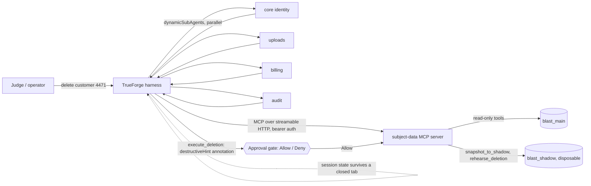

# Blast Radius

Blast Radius is an erasure agent for a PostgreSQL customer database. Given
"delete everything we hold for customer 4471," it has to reconcile two valid
legal obligations at once: GDPR's right to erasure, and tax law's requirement
to keep seven years of invoice records for the same customer.

## What you will see in the demo

- The agent is asked to erase one named customer. It fans discovery out
  across four data domains in parallel (core identity, uploads, billing,
  audit), each search returning a table-and-count summary, never row
  contents.
- It reads the foreign-key graph and the retention policy table, then drafts
  a deletion plan.
- It snapshots the database to a disposable shadow copy and rehearses the
  plan there.
- The naive plan **succeeds** in rehearsal, and that is the problem: it
  cascades into the customer's orders and order line items, both of which a
  retention policy protects. A plan that runs with no error is not
  automatically a plan that is legal.
- The agent revises on its own: hard-delete the personal-data-only records,
  anonymise the customer row so the foreign key still resolves and the
  protected financial records survive. It rehearses again and gets a clean
  result.
- `execute_deletion` carries a destructive annotation, so the harness pauses
  and shows the plan and the measured blast radius. A human chooses Allow or
  Deny.
- On Allow, the agent executes, verifies the outcome against what the
  rehearsal predicted, and reports a receipt: what was deleted, what was
  anonymised, and under which policy.

## Setup

From a clean clone:

```bash
cp .env.example .env          # set MCP_AUTH_TOKEN to a value you'll reuse below
docker compose up -d --build  # postgres + redis + the subject-data MCP server on :8080
```

Register the MCP connector in TrueForge: Settings → Connectors → Add MCP
Server, URL `http://mcp-server:8080/mcp`, bearer token from `.env`.

Register the skill in TrueForge: Settings → Skills → Add Skill, repository
URL for this repo, path `skills/gdpr-erasure`, and a **ref pinned to a commit
SHA**, not a branch name (a skill re-materializes from that ref at runtime,
so a branch ref would change under you). Get the current SHA with:

```bash
git log -1 --format=%H -- skills/gdpr-erasure/SKILL.md
```

Provision the agent:

```bash
cd packages/agent && npm install && npm run provision
```

The agent's `config.sandbox.enabled` must be `true` in
`packages/agent/agent.manifest.json` (it is, by default). Skills do not load
into a session without a sandbox, regardless of whether the skill itself is
registered correctly.

To verify the stack without a live TrueForge session, run the smoke suite
described in `docs/runbook.md`. To verify the full harness behaviour,
including the approval gate actually firing, follow `docs/ACCEPTANCE.md`.

## Architecture



- **MCP tool routing with approval annotations.** All seven tools
  (`inspect_schema`, `list_foreign_keys`, `get_retention_policies`,
  `find_subject_data`, `snapshot_to_shadow`, `rehearse_deletion`,
  `execute_deletion`) live behind one streamable-HTTP MCP server. Six carry a
  read-only or shadow-write annotation and never gate. `execute_deletion`
  alone carries the destructive annotation and is also listed in the agent
  manifest's `requireApprovalForTools`; either one gating it independently is
  deliberate redundancy, described in `docs/runbook.md`.
- **Parallel subagents.** Discovery is delegated across the four data
  domains at once (`dynamicSubAgents` in the agent config), each domain
  searched differently and each returning a summary rather than row
  contents. See `skills/gdpr-erasure/references/discovery-brief.md`.
- **Session persistence.** The harness keeps session state (Redis-backed)
  independent of any open browser tab, so a run's history and a pending
  approval gate survive a closed and reopened tab. See assertion 11 in
  `docs/ACCEPTANCE.md`.
- **Generative UI.** Enabled in the agent config for rendering the plan and
  measured blast radius at the approval gate, rather than requiring it to be
  read out of a plain-text tool result.
- **Skills, not code execution.** The procedure lives in
  `skills/gdpr-erasure/SKILL.md`, loaded into the sandboxed session at
  `/opt/tfy/skills/gdpr-erasure`. Blast Radius does not use TrueForge's Code
  Mode: every action the agent takes is one of the seven MCP tool calls
  above, not agent-authored code the harness executes.

The rehearsal itself is not sandboxed code execution either. It is the
`rehearse_deletion` MCP tool, which really runs the plan inside the
disposable shadow database and rolls the transaction back. Its numbers are
measured, not predicted.

## Qodo Code Review Evidence

Representative merged PR with meaningful hackathon code:
`<<MERGED_PR_LINK>>`

What Qodo surfaced and what we changed or dismissed:
`<<QODO_FINDING_SUMMARY: one or two sentences once a review has run>>`

PR history showing the completed review, our decisions, and a follow-up
review against the final code: `<<QODO_PR_HISTORY_LINK>>`

See `docs/ACCEPTANCE.md`'s Qodo sweep table for the status of every PR's
High-severity findings; every merged PR must show each one fixed or
dismissed with a recorded reason before submission.

## AI assistance

Per hackathon rule 12, this project used AI coding assistants throughout.
Roughly, by area:

- **Aditya Gaur** (MCP server, provisioning, runbook): mainly Claude Code,
  with some use of Codex.
- **Aarav Vivek** (UI): Codex.
- **Nishad Mulay** (demo database and Faker seed): Codex.
- **Amelia Patel** (skill, acceptance script, README, submission and
  presentation docs): Claude Code.
- Team-wide: Claude and Gemini for early ideas and brainstorming, and for
  help setting up the TrueForge, Daytona, and Ubuntu environment.

Every merged change went through a Qodo-reviewed pull request (see Qodo Code
Review Evidence above), and each owner reviewed and can explain the area
they own, per rules 12 through 14.

## Data

All data in the demo database is synthetic, generated with Faker. No real
customer data, and no credentials, are committed to this repository; secrets
are supplied at runtime through `.env` (see `.env.example`).
