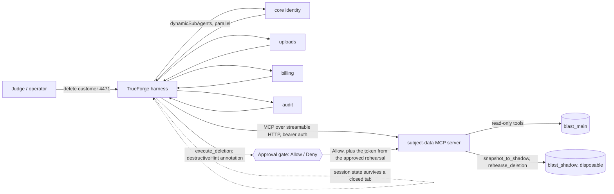

# Blast Radius

Blast Radius is an erasure agent for a PostgreSQL customer database. Given
"delete everything we hold for customer 4471," it has to reconcile two valid
legal obligations at once: GDPR's right to erasure, and tax law's requirement
to keep seven years of invoice records for the same customer.

## What you will see in the demo

- The agent is asked to erase one named customer. It fans discovery out
  across four data domains in parallel (core identity, uploads, billing,
  audit), each search returning a table-and-count summary, never row
  contents.
- It reads the foreign-key graph and the retention policy table, then drafts
  a deletion plan.
- It snapshots the database to a disposable shadow copy and rehearses the
  plan there.
- The naive plan **succeeds** in rehearsal, and that is the problem: it
  cascades into the customer's orders and order line items, both of which a
  retention policy protects. A plan that runs with no error is not
  automatically a plan that is legal.
- The agent revises on its own: hard-delete the personal-data-only records,
  anonymise the customer row so the foreign key still resolves and the
  protected financial records survive. It rehearses again and gets a clean
  result.
- `execute_deletion` carries a destructive annotation, so the harness pauses
  and shows the plan and the measured blast radius. A human chooses Allow or
  Deny.
- On Allow, the agent executes, verifies the outcome against what the
  rehearsal predicted, and reports a receipt: what was deleted, what was
  anonymised, and under which policy.

## Setup

The tested, step-by-step walkthrough from a clean clone, including running
TrueForge itself, is `docs/SETUP.md`. It was written against a Windows +
Docker Desktop run and calls out where macOS/Linux differ; follow it, not the
summary below, if this is your first time standing up the stack.

Short version, once you know the shape of it:

```bash
cp .env.example .env          # set MCP_AUTH_TOKEN, and see docs/SETUP.md re: port defaults
docker compose up -d --build  # postgres + redis + the subject-data MCP server
```

Register the MCP connector in TrueForge (Settings → Connectors → Add MCP
Server) with the bearer token from `.env`. The URL depends on whether
TrueForge shares a Docker network with this stack: if it does, use
`http://mcp-server:<PORT>/mcp`; if TrueForge runs as its own separate stack
(the common case, see `docs/SETUP.md` Part 2), use
`http://host.docker.internal:<MCP_HOST_PORT>/mcp` from the host's point of
view instead, since `localhost` inside TrueForge's own container means
TrueForge, not this one.

Register the skill (Settings → Skills → Add Skill) with a repository URL,
path `skills/gdpr-erasure`, and a **ref pinned to a commit SHA**, not a
branch name, so what loads at runtime cannot drift out from under you. Get
the current SHA with:

```bash
git log -1 --format=%H -- skills/gdpr-erasure/SKILL.md
```

Provision the agent. `.env` configures the Docker Compose stack only;
`packages/agent/provision.ts` reads `process.env` directly and will not load
it, so export the same values (plus the TrueForge-side ones) in the shell
you run this from:

```bash
cd packages/agent && npm install
export TRUEFORGE_BASE_URL=http://localhost:8791
export TRUEFORGE_TOKEN=<your value>
export MODEL_NAME=<provider>/<model>
export MCP_AUTH_TOKEN=<same value as .env>
export MCP_SERVER_URL=<see docs/SETUP.md Part 4 for host.docker.internal vs. same-network>
npm run provision
```

`packages/agent/agent.manifest.json`'s `config.sandbox.enabled` must be
`true` (it is, by default) and a sandbox provider (Daytona) must be
configured in TrueForge first: an agent spec with a sandbox or a skill is
rejected at session creation without one. The provisioning script does not
print which tools ended up gated, so verify it directly: check
`requireApprovalForTools` in `agent.manifest.json` (should list only
`execute_deletion`), and confirm the same in the TrueForge UI under the
agent's settings after `npm run provision` completes.

To verify the stack without a live TrueForge session, run the smoke suite
described in `docs/runbook.md`. To verify the full harness behaviour,
including the approval gate actually firing, follow `docs/ACCEPTANCE.md`.

## Architecture



- **MCP tool routing with approval annotations.** All seven tools
  (`inspect_schema`, `list_foreign_keys`, `get_retention_policies`,
  `find_subject_data`, `snapshot_to_shadow`, `rehearse_deletion`,
  `execute_deletion`) live behind one streamable-HTTP MCP server. Six carry a
  read-only or shadow-write annotation and never gate. `execute_deletion`
  alone carries the destructive annotation and is also listed in the agent
  manifest's `requireApprovalForTools`; either one gating it independently is
  deliberate redundancy, described in `docs/runbook.md`.
- **The approval is bound to the plan, not just requested before it.** A
  clean `rehearse_deletion` mints a single-use token fingerprinted to the
  exact plan it measured; `execute_deletion` requires that token and refuses
  a plan that does not match it, even a superficially similar one offered
  after an error. This exists because of a real failure, not a hypothetical
  one: on a live run, a rejected plan led the agent to retry with a smaller,
  unrehearsed one, and the tool executed it, destroying rows the rehearsal
  had just proven were protected. The gate stopping to ask is necessary but
  was not, on its own, sufficient. See assertion 9 in `docs/ACCEPTANCE.md`.
- **Parallel subagents.** Discovery is delegated across the four data
  domains at once (`dynamicSubAgents` in the agent config), each domain
  searched differently and each returning a summary rather than row
  contents. See `skills/gdpr-erasure/references/discovery-brief.md`.
- **Session persistence.** The harness keeps session state (Redis-backed)
  independent of any open browser tab, so a run's history and a pending
  approval gate survive a closed and reopened tab. See assertion 12 in
  `docs/ACCEPTANCE.md`.
- **Generative UI.** Enabled in the agent config for rendering the plan and
  measured blast radius at the approval gate, rather than requiring it to be
  read out of a plain-text tool result.
- **Skills, not code execution.** The procedure lives in
  `skills/gdpr-erasure/SKILL.md`, loaded into the sandboxed session at
  `/opt/tfy/skills/gdpr-erasure`. Blast Radius does not use TrueForge's Code
  Mode: every action the agent takes is one of the seven MCP tool calls
  above, not agent-authored code the harness executes.

The rehearsal itself is not sandboxed code execution either. It is the
`rehearse_deletion` MCP tool, which really runs the plan inside the
disposable shadow database and rolls the transaction back. Its numbers are
measured, not predicted.

## Qodo Code Review Evidence

Representative merged PR with meaningful hackathon code:
`<<MERGED_PR_LINK>>`

What Qodo surfaced and what we changed or dismissed:
`<<QODO_FINDING_SUMMARY: one or two sentences once a review has run>>`

PR history showing the completed review, our decisions, and a follow-up
review against the final code: `<<QODO_PR_HISTORY_LINK>>`

See `docs/ACCEPTANCE.md`'s Qodo sweep table for the status of every PR's
High-severity findings; every merged PR must show each one fixed or
dismissed with a recorded reason before submission.

## AI assistance

Per hackathon rule 12, this project used AI coding assistants throughout.
Roughly, by area:

- **Aditya Gaur** (MCP server, provisioning, runbook): mainly Claude Code,
  with some use of Codex.
- **Aarav Vivek** (UI): Codex.
- **Nishad Mulay** (demo database and Faker seed): Codex.
- **Amelia Patel** (skill, acceptance script, README, submission and
  presentation docs): Claude Code.
- Team-wide: Claude and Gemini for early ideas and brainstorming, and for
  help setting up the TrueForge, Daytona, and Ubuntu environment.

Every merged change went through a Qodo-reviewed pull request (see Qodo Code
Review Evidence above), and each owner reviewed and can explain the area
they own, per rules 12 through 14.

## Data

All data in the demo database is synthetic, generated with Faker. No real
customer data, and no credentials, are committed to this repository; secrets
are supplied at runtime through `.env` (see `.env.example`).
